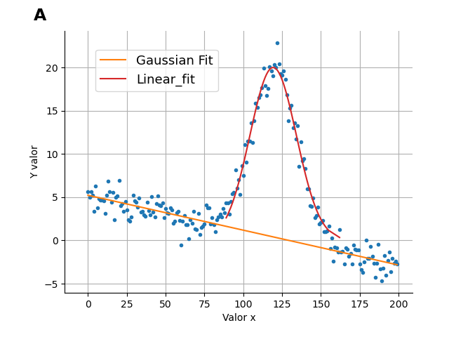

<!-- <h1 align="center"> -->
<!--  -->
<!-- </h1>  -->

<h1 align="center">
Itfit
</h1>
<h2 align="center">
Interactive Fitter
</h2> 

Simple, intuitive and interactive application to help fitting common functions to your data.

<h1 align="center">

</h1>

<h1 align="center">

</h1>

# Instalation

# Documentation

# Contribute