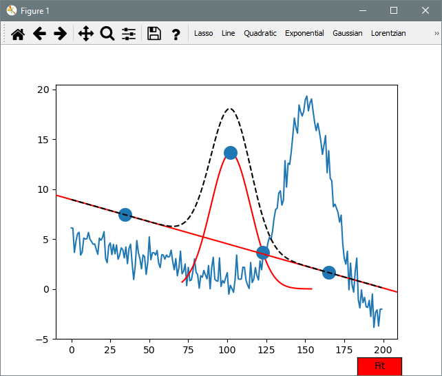

<!-- Copyright 2023 Unai Lería Fortea & Pablo Vizcaíno García

Licensed under the Apache License, Version 2.0 (the "License");
you may not use this file except in compliance with the License.
You may obtain a copy of the License at

http://www.apache.org/licenses/LICENSE-2.0

Unless required by applicable law or agreed to in writing, software
distributed under the License is distributed on an "AS IS" BASIS,
WITHOUT WARRANTIES OR CONDITIONS OF ANY KIND, either express or implied.
See the License for the specific language governing permissions and
limitations under the License. -->

# 2. Fit Builder example

Here we will show an example of combining already existing fitting functions with the [FunctionBuilder][itfit.FunctionBuilder]. Suppose we have data following:
$$
f(x) = m\cdot x + n + A\cdot exp\left({\frac{(x-m)^2}{2s^2}}\right) + \xi
$$
Where $\xi$ is some random noise. And we are interested in knowing the value of $m$: the gaussian center.

```py
import numpy as np

def gauss(x, A, x0, sigma):
    return A * np.exp(-(x - x0) ** 2 / (2 * sigma ** 2))

def dataFunction(x, m, n, A, x0, sigma):
    return m*x + n + gauss(x, A ,x0, sigma)

noise = np.random.normal(size=200)

xdata = np.arange(200)
ydata = dataFunction(xdata, -0.04, 5, np.random.random()
                     * 30, np.random.random()*200, 15) + noise
```

This function is a linear combination of linear and gaussian functions therefore if we only fit a gaussian the result could be bias due to the linear background. Lets then create a function that has that background in its definition:

```py linenums="1" hl_lines="8"
import matplotlib.pyplot as plt
import itfit
from itfit.fit_functions import Gaussian, Line

fitter = itfit.Fitter(xdata, ydata)
function_builder = itfit.FunctionBuilder(fitter)

function_builder.define(Gaussian + Line)

fitter()
fitter.add_custom_fit_function(function_builder)
plt.show()
```
As you can see, we have defined a function as `Gaussian + Linear`. All default operations (`+`, `-`, `*`, `/`, `**`, `%` and `//`) are supported between already created functions. Also chaining operations with brackets is supported, just as regular numbers!
Once we add the custom function to the [Fitter][itfit.Fitter] a new tool will appear with the new function just defined.




Now move those points until the black dashed line is close to the desired result.