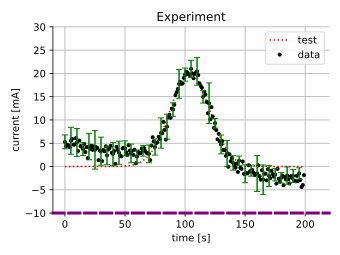

<!-- Copyright 2023 Unai Lería Fortea & Pablo Vizcaíno García

Licensed under the Apache License, Version 2.0 (the "License");
you may not use this file except in compliance with the License.
You may obtain a copy of the License at

http://www.apache.org/licenses/LICENSE-2.0

Unless required by applicable law or agreed to in writing, software
distributed under the License is distributed on an "AS IS" BASIS,
WITHOUT WARRANTIES OR CONDITIONS OF ANY KIND, either express or implied.
See the License for the specific language governing permissions and
limitations under the License. -->

# 3. Plot Builder example

Lets explore the [PlotBuilder][itfit.plot.builder.PlotBuilder] capabilities in search of an awful plot. We will use the same function from [last example](2-fitting-function-builder.md) to create some data:

```py
import numpy as np
import matplotlib.pyplot as plt
import itfit

def gauss(x, A, x0, sigma):
    return A * np.exp(-(x - x0) ** 2 / (2 * sigma ** 2))

def dataFunction(x, m, n, A, x0, sigma):
    return m*x + n + gauss(x, A ,x0, sigma)

noise = np.random.normal(size=200)

xdata = np.arange(200)
ydata = dataFunction(xdata, -0.04, 5, 20, 105, 15) + noise
```
Now we call the [Fitter][itfit.Fitter] and fit the data to a [gaussian][itfit.fit_functions.gaussian.gaussian] predefined function.
```py
fitter_app = itfit.Fitter(xdata, ydata)

fitter_app()
plt.show()
```
Once we fit the data we call the [PlotBuilder][itfit.plot.builder.PlotBuilder]. This class is very usefull if you are using a jupyther notebook as changes are made instantly over the same figure. The main think to keep in mind when using the PlotBuilder is that all methods return the PlotBuilder instance, therefore you can chain changes until you get the desired result.

PlotBuilder is more limited than using Matplotlib's figure and axes, but it is easier to plot the fit with the corresponding data. Although figure and axe are accesible via `.fig` and `.ax` attributes.

```py
fit = fitter_app.get_plot_builder()\
    .style("science")\
    .plot_fit(':', 'red', 'test')\
    .with_data('.', 'black', 'data')\
    .xlabel("time [s]")\
    .ylabel("current [mA]")\
    .title("Experiment")\
    .grid()\
    .legend()\
    .set_xlim(-10, 220)\
    .set_ylim(-10, 30)\
    .spines().start_top_spine().invisible().end_top_spine()\
             .start_right_spine().alpha(0.33).color("white").end_right_spine()\
             .start_bottom_spine().linestyle('--').color('purple').linewidth(3).end_bottom_spine()\
    .end_spines()\
    .set_size((12,9))\
    .tight_layout()\
    .save_fig("this_is_not_ok.svg")
```

