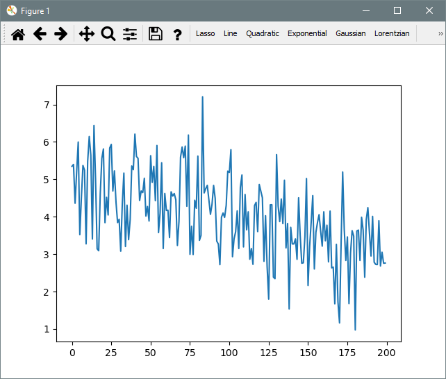
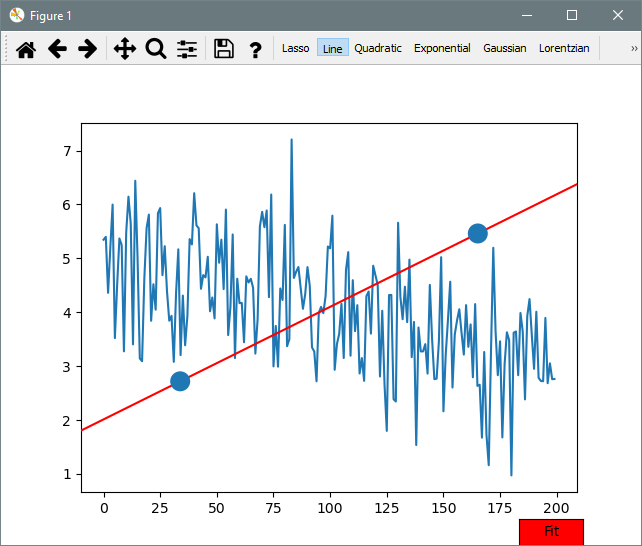
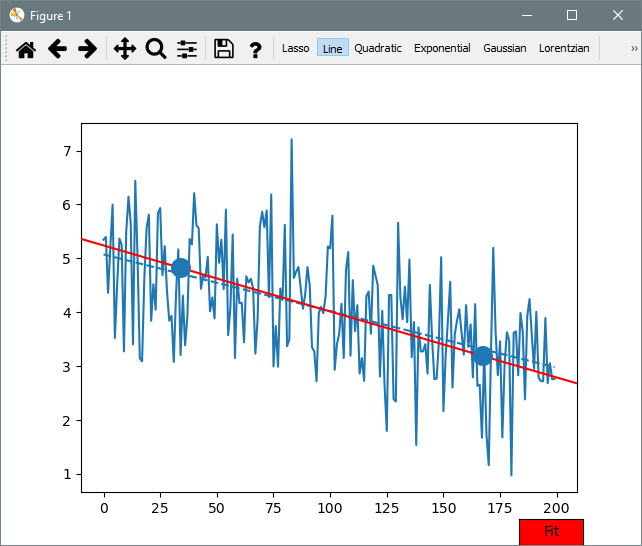

<!-- Copyright 2023 Unai Lería Fortea & Pablo Vizcaíno García

Licensed under the Apache License, Version 2.0 (the "License");
you may not use this file except in compliance with the License.
You may obtain a copy of the License at

http://www.apache.org/licenses/LICENSE-2.0

Unless required by applicable law or agreed to in writing, software
distributed under the License is distributed on an "AS IS" BASIS,
WITHOUT WARRANTIES OR CONDITIONS OF ANY KIND, either express or implied.
See the License for the specific language governing permissions and
limitations under the License. -->

# 1. Quickstart

Lets start with something really easy. Fit a line with some noise $\xi$ and save a figure with the plot. 

$$
f(x) = m\cdot x + n + \xi
$$

We are going to use the following data:
```py
import numpy as np

def dataFunction(x, m, n):
    return m*x + n

noise = np.random.normal(size=200)

xdata = np.arange(200)
ydata = dataFunction(xdata, -2/200, 5) + noise
```

Now we call the [Fitter][itfit.Fitter]:
```py
import matplotlib.pyplot as plt
import itfit

fitter = itfit.Fitter(xdata, ydata)
fitter()
plt.show()
```
The following window should appear:



Now select the `Line` tool. A line with 2 dots should appear:



Those points are draggable, move them around to set the initial conditions in the search of the optimal parameters. Once you are close to the expected result press the `Fit` button bellow.



A dashed line will appear. This is the fit, but we want it prettier. We can use the default plot for now:

```py
plot = fitter.default_plot_last_fit("Time $[s^{-1}]$", "Value", "Title")
plt.show()
```
This would yield


And finally we can save the plot with:
```py
plot.save_fig("example.png")
```

Where to go next:

* If you are interested in more complex functions see [FunctionBuilder example](2-fitting-function-builder.md).
* For further plot customization see [PlotBuilder example](3-plot-builder.md). 