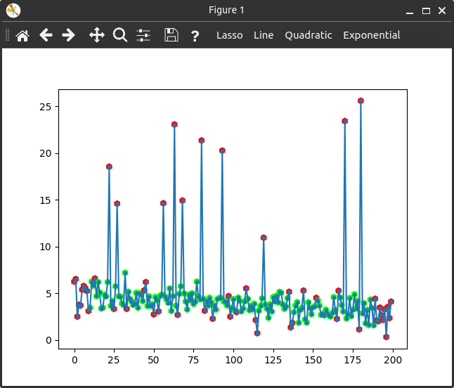

<!-- Copyright 2023 Unai Lería Fortea & Pablo Vizcaíno García

Licensed under the Apache License, Version 2.0 (the "License");
you may not use this file except in compliance with the License.
You may obtain a copy of the License at

http://www.apache.org/licenses/LICENSE-2.0

Unless required by applicable law or agreed to in writing, software
distributed under the License is distributed on an "AS IS" BASIS,
WITHOUT WARRANTIES OR CONDITIONS OF ANY KIND, either express or implied.
See the License for the specific language governing permissions and
limitations under the License. -->

# 4. Filter example

Lets use a filter to select our data. We will use the same data generation as the first example, with some points with extra noise. The objective is to filter them using a sliding window and percentiles. 


```py
import numpy as np
import matplotlib.pyplot as plt
import itfit

def dataFunction(x, m, n):
    return m*x + n

noise = np.random.normal(size=200)

# Extra noisy points!
for _ in range(10):
    ind = np.random.randint(0, 200)
    noise[ind] = np.random.random()*20+5

xdata = np.arange(200)
ydata = dataFunction(xdata, -2/200, 5) + noise

```

Now we create a filter. Itfit can use filters that accept 2 arguments and return a boolean (or array of booleans). In this example we use a sliding window and percentiles to select the points that are between percentiles 95 and 5.

```py
def my_filter(x, y) -> list[bool]:
    selection = np.zeros(x.shape, dtype=bool)
    window_size = 21
    selection[:window_size//2] = False
    selection[-(window_size//2 + 1):] = False

    for i, window in enumerate(np.lib.stride_tricks.sliding_window_view(y, window_size)):
        p95 = np.percentile(window, 95)
        p05 = np.percentile(window, 5)

        selection[window_size//2 + i] = True if p05 < window[window_size//2] < p95 else False
        
    return selection
```


Now we call the [Fitter][itfit.Fitter] and fit the data to the [line][itfit.fit_functions.linear.linear] predefined function.
```py
fitter = itfit.Fitter(xdata, ydata)
fitter.add_filter(my_filter)
fitter()
plt.show()

plot.save_fig("noisy_friend.png")
```
We will see that the filter was already applied and the extreme noise was rejected:
